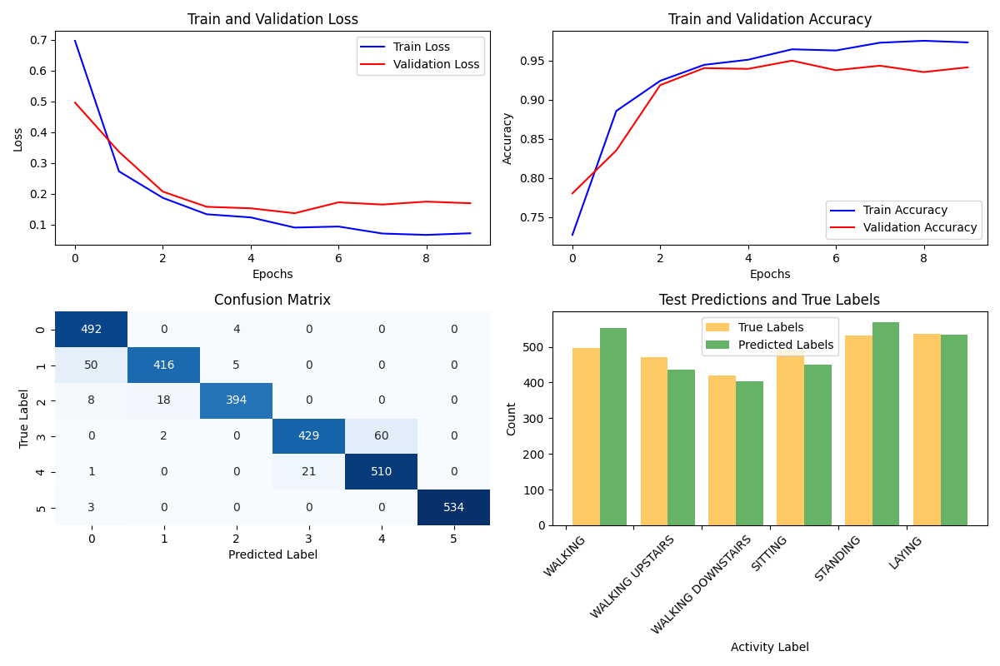

# tcn_har
A motion classification program in TCN using HAR dataset.

## Downloading HAR Dataset
First, download the HAR dataset from the following site.

```
wget https://archive.ics.uci.edu/ml/machine-learning-databases/00240/UCI%20HAR%20Dataset.zip
```

Unzip the dataset.
```
unzip UCI\ HAR\ Dataset.zip
```

## Running tcn
Next, run tcn_wrapper_HAR.py.
```
python tcn_wrapper_HAR.py.
```

## Learning Results
Obtain the following learning results.


